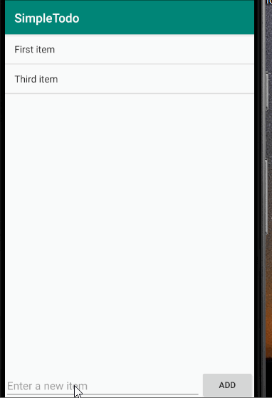

# Pre-work - *Simple Todo*
**Simple Todo** is an android app that allows building a todo list and basic todo items management functionality including adding new items, editing and deleting an existing item.
Submitted by: **Yemane Zewdu**

Time spent: **4** hours spent in total

## User Stories
The following **required** functionality is completed:

* [x] User can successfully add and remove items from the todo list
* [ ] User can tap a todo item in the list and bring up an edit screen for the todo item and then have any changes to the text reflected in the todo list.
* [x] User can persist todo items and retrieve them properly on app restart

The following **optional** features are implemented:

* [ ] Persist the todo items into SQLite instead of a text file
* [ ] Improve style of the todo items in the list using a custom adapter
* [ ] Add support for completion due dates for todo items (and display within listview item)
* [ ] Use a DialogFragment instead of new Activity for editing items
* [ ] Add support for selecting the priority of each todo item (and display in listview item)
* [ ] Tweak the style improving the UI / UX, play with colors, images or backgrounds

The following additional features are implemented:

* [ ] List anything else that you can get done to improve the app functionality!

## Video Walkthrough
Here's a walkthrough of implemented user stories:

 
 
 GIF created with [LiceCap](http://www.cockos.com/licecap/).

## Notes
 
 Describe any challenges encountered while building the app
